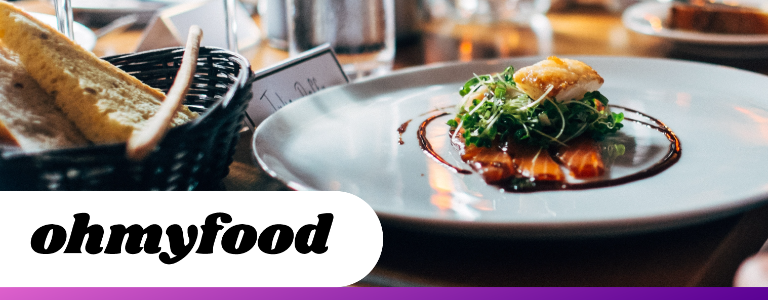

Openclassrooms Projet 3 : 
Dynamisez une page web avec des animations CSS : Site ohmyfood

Le context du projet :
 - Recruté en tant que développeur junior chez Ohmyfood!
 - Jeune startup de commande de repas en ligne qui souhaite s’imposer sur le marché de la restauration à Paris.
 - Son site 100 % mobile permet aux utilisateurs de composer leur propre menu et réduire leur temps d’attente dans les restaurants car leur menu est préparé à l’avance.
 - Le site se compose dans un premier temps de 4 menus et sera dynamisé avec des animations CSS.

 Cahier des charges : 

Spécifications techniques : 
 - 2 maquettes à intégrer : mobile imposé et libre pour desktop / tablette.
 - Identité graphique :
    - fonts : logo et titre : Shrikhand / texte : Roboto
    - couleurs : primaire #9356DC (violet), secondaire #FF79DA (rose), tertiaire #99E2D0 (vert).
    - Développement à réaliser uniquement en HTML et CSS (préprocesseur Sass). 
    - Validation du code par W3C.
    - Compatibilité avec les navigateurs Chrome et Firefox.
Spécifications fonctionnelles : 
 - Les cartes des restaurants sur la page d'accueil redirigent l’utilisateur vers la page du menu du restaurant.
 - Une flèche dans l’entête des pages des menus renvoie à l'accueil.
 - Le lien “Contact” dans le pied de page renvoie vers une adresse mail.
 - Les animations : 
    - Loading spinner sur la page d'accueil.
    - Les boutons doivent s'éclaircir et l’ombre s'accentuer, les “j’aime” en forme de cœur doivent se remplir progressivement. 
    - Les menus doivent apparaître progressivement, et le clic/survole doit faire apparaître une coche coulissante.
    - Les intitulés des menus doivent être rognés au besoin avec “...”.

